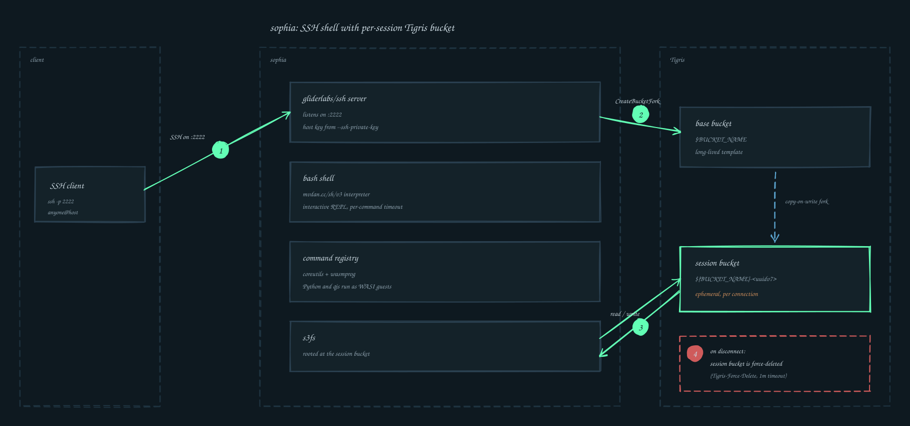

# sophia

sophia is an SSH server that drops each connecting user into a Kefka shell
session backed by an isolated, per-connection
[Tigris](https://www.tigrisdata.com/) bucket. Every command runs inside that
scratch bucket; when the user disconnects, the bucket is force-deleted.

The shell is [`mvdan.cc/sh/v3`](https://pkg.go.dev/mvdan.cc/sh/v3) wired up to
Kefka's command registry (`coreutils` and `wasmprog`), so common POSIX
utilities, plus Python and qjs running as WASI guests, are available without
touching the host.

## Architecture

Sophia creates a separate [Tigris fork/branch](https://www.tigrisdata.com/docs/forks/) per connection. The end-to-end management flow looks something like this:



## Running it

sophia is a single Go binary:

```sh
go build ./cmd/sophia
./sophia
```

A prebuilt container image is published at
[`atcr.io/xeiaso.net/kefka/sophia:latest`](https://atcr.io/r/xeiaso.net/kefka/sophia#overview):

```sh
docker run --rm -it \
  -p 2222:2222 \
  -e BUCKET_NAME=your-bucket \
  -v "$PWD/var:/var" \
  atcr.io/xeiaso.net/kefka/sophia:latest
```

Mount a directory containing `ssh_host_ed25519_key` and
`ssh_host_ed25519_key.pub` at `/var` (or override the paths with
`--ssh-private-key`/`--ssh-public-key`) so the host key survives container
restarts.

### Environment

| Variable          | Required | Notes                                                                                        |
| ----------------- | -------- | -------------------------------------------------------------------------------------------- |
| `BUCKET_NAME`     | yes      | Base bucket that gets forked per session. Can also be passed via `--bucket`.                 |
| `SSH_PRIVATE_KEY` | no       | Override for `--ssh-private-key`.                                                            |
| `SSH_PUBLIC_KEY`  | no       | Override for `--ssh-public-key`.                                                             |
| Tigris auth       | yes      | sophia uses `github.com/tigrisdata/storage-go`, so any credentials it reads also apply here. |

A `.env` file in the working directory is loaded automatically (via
`github.com/joho/godotenv/autoload`).

### Flags

| Flag                | Short | Default                          | Description                                         |
| ------------------- | ----- | -------------------------------- | --------------------------------------------------- |
| `--bind`            | `-b`  | `:2222`                          | host:port to bind the SSH listener to.              |
| `--bucket`          | `-B`  | `$BUCKET_NAME`                   | base bucket to fork per session.                    |
| `--timeout`         | `-T`  | `5m`                             | maximum wall-clock duration for any single command. |
| `--ssh-private-key` |       | `./var/ssh_host_ed25519_key`     | path to the SSH host private key (PEM).             |
| `--ssh-public-key`  |       | `./var/ssh_host_ed25519_key.pub` | path to the SSH host public key.                    |

Both key paths are checked for existence at startup; sophia exits non-zero
before binding the port if either file is missing or unreadable. This is a
deliberate guardrail — without a persistent host key, clients see a host key
mismatch on every restart and refuse to reconnect.

## Generating SSH host keys

sophia does not generate host keys for you. Create them once with
`ssh-keygen`:

```sh
mkdir -p var
ssh-keygen -t ed25519 -N '' -f ./var/ssh_host_ed25519_key
```

`ssh-keygen` writes the private key to the path you give it and the public
key to `<path>.pub`, which lines up with sophia's defaults. Treat the
private key like any other secret — it identifies your server to every
client that has trusted it before.

These SSH keys should be put in a Kubernetes Secret or other platform-native
secret abstraction before deploying Sophia in production.

## Connecting

Any username works; sophia does not currently authenticate users (every
session is sandboxed in its own bucket). With the server running:

```sh
ssh -p 2222 anyone@localhost
```

You'll see the MOTD, a line announcing which session bucket was forked from
which base bucket, and a `$` prompt. Exit with `Ctrl-D` or `exit`.

## Session lifecycle

1. Client connects. sophia creates a UUIDv7 and forks `$BUCKET_NAME` into
   `$BUCKET_NAME-<uuid>` using `CreateBucketFork`.
2. The shell runs against an `s3fs` rooted at the session bucket. Files
   written during the session live only in that fork.
3. On disconnect, sophia deletes the session bucket with a one-minute
   timeout and the `Tigris-Force-Delete` header set, so non-empty buckets
   are cleaned up too.
4. `--timeout` is a per-command cap, not a per-session cap. Long-running
   sessions are fine; individual commands that exceed the timeout are
   cancelled and the prompt returns.
